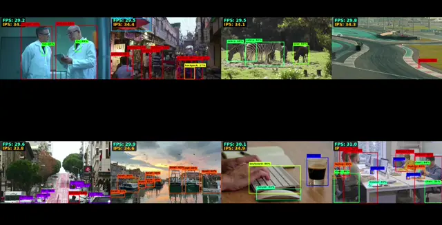
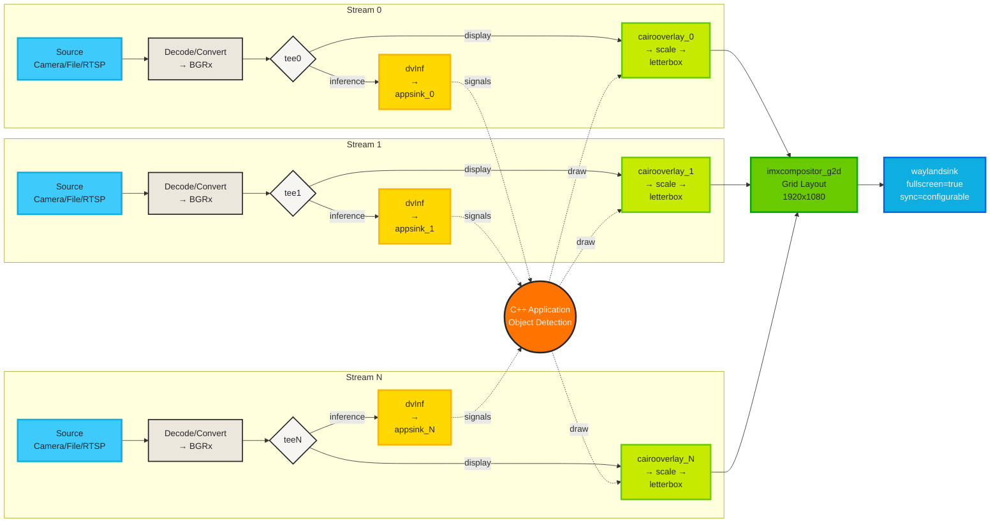

<div align="center">

# Multi-stream GStreamer Example for YOLOv8

[](./LICENSE.txt)
[](https://www.nxp.com/products/processors-and-microcontrollers/arm-processors/i-mx-applications-processors:IMX_HOME)
[](https://isocpp.org/)
[](https://www.nxp.com/docs/en/user-guide/UG10166.pdf)

---

</div>

## 📖 Example Description

This example demonstrates multi-stream object detection using
YOLOv8 models accelerated by the NXP Ara240 DNPU. It leverages
GStreamer to process up to **eight simultaneous video streams**
from **multiple input sources** including cameras 📹, video
files 🎬, RTSP streams 📡, and test patterns 🎨.

<div align="center">

<br><i>Figure 1. Object detection on eight video streams running on FRDM i.MX 95.</i>
</div>

## 🔰 GStreamer Pipeline - Block Diagram

Below is a block diagram representing the multi-stream
GStreamer pipeline for this example.



## ✨ Key Features

- 🎥 **Multi-Stream Processing**: Handles 1 to 8 video
  streams concurrently with real-time* object detection
- 🔀 **Multiple Input Sources**: Support for cameras, video
  files, RTSP streams, and test patterns
- 📹 **Camera Support**: Direct V4L2 camera input with
  hardware-accelerated ISP
- 🎬 **Video File Support**: H.264 video file playback with
  hardware decoding
- 📡 **RTSP Streaming**: Connect to IP cameras and RTSP
  sources
- 🎨 **Test Patterns**: Built-in test pattern generator for
  debugging
- 🔀 **Mixed Sources**: Combine different input types in a
  single session
- 📄 **JSON Configuration**: Load complex multi-stream
  setups from configuration files
- ⚡ **Hardware Acceleration**: Utilizes NXP Ara240 DNPU
  for efficient YOLOv8 inference
- 🎯 **Multiple Model Support**: Choose from 5 YOLOv8
  variants (nano, small, medium, large, extra-large) to
  balance speed and accuracy
- 🎬 **GStreamer Integration**: Built on robust GStreamer
  framework for video processing and pipeline management
- 👁️ **Visual Output**: Displays detected objects with
  bounding boxes in a mosaic layout
- 🔄 **Configurable Synchronization**: Runtime control of
  frame synchronization behavior via command-line flag
- 📊 **Real-time Performance Metrics**: Live FPS (Frames
  Per Second) and IPS (Inferences Per Second) overlay for
  each stream
- 📈 **Detailed Performance Stats Mode**: Optional extended
  performance diagnostics

## 🎯 Target Applications

- 📹 Multi-camera surveillance systems
- 🏭 Industrial monitoring and quality control
- 🏙️ Smart city infrastructure
- 🛒 Retail analytics
- 🚗 Autonomous vehicle testing and validation
- 🏢 Building security and access control
- 🚦 Traffic monitoring and analysis
- 📡 Remote monitoring via RTSP streams

## 💻 Supported Platforms

| Platform            | Supported |
| ------------------- | :-------: |
| [FRDM i.MX 8M Plus] |    ✅     |
| [FRDM i.MX 95]      |    ✅     |

[FRDM i.MX 8M Plus]: (https://www.nxp.com/design/design-center/development-boards-and-designs/FRDM-IMX8MPLUS)
[FRDM i.MX 95]: (https://www.nxp.com/design/design-center/development-boards-and-designs/FRDM-IMX95)

## ⚙️ Features

### 🔧 Technical Specifications

#### 🤖 AI Model

- **Framework**: Optimized for NXP Ara240 DNPU
- **Object Classes**: 80 COCO dataset classes
- **Detection Capabilities**: Real-time object detection
- **Model Variants**: YOLOv8n, YOLOv8s, YOLOv8m, YOLOv8l,
  YOLOv8x

#### 🎬 Video Processing

- **Camera Input**: V4L2 compatible cameras with ISP
  support
- **RTSP Streaming**: IP cameras and network video sources
- **Video Files**: H.264, raw video
- **Test Patterns**: SMPTE, snow, black, and other test
  patterns
- **Buffering**: Hardware-accelerated video decoding

#### 🔌 Connectivity Options

- **PCIe Interface**: High-bandwidth endpoint for maximum
  throughput
- **Endpoint Selection**: Runtime configurable via
  command-line options

#### 📏 Scalability

- **Stream Configuration**: Dynamically adjustable from 1
  to 8 streams
- **Graceful Degradation**: Maintains performance with
  varying stream counts

## 📋 Requirements

### 🧰 Hardware

- Supported FRDM i.MX platform
- Ara240 DNPU
- Power supply (5V/3A recommended)
- USB-C debug cable
- HDMI Cable
- 1920x1080 Display monitor
- 📹 **Optional**: USB or MIPI-CSI cameras (V4L2
  compatible)
- 📡 **Optional**: IP cameras with RTSP support

### 📷 Input Source Compatibility

The application supports multiple input source types:

#### 🔌 V4L2 Cameras

- **USB Cameras**: UVC-compliant USB webcams
- **MIPI-CSI Cameras**: Connected via MIPI-CSI interface
- **Default Resolution**: 640x360 @ 30fps (configurable
  per camera)

#### 📡 RTSP Streams

- **IP Cameras**: Network cameras with RTSP support
- **Configurable Latency**: Adjustable buffering (default:
  200ms)

#### 🎬 Video Files

- **Formats**: H.264, MP4
- **Loop Playback**: Automatic restart when file ends
- **Hardware Decoding**: Accelerated video decoding

#### 🎨 Test Patterns

- **Built-in Patterns**: SMPTE, snow, black, white, etc.
- **Configurable Resolution**: Any supported resolution
- **Debugging Tool**: Useful for pipeline testing

> **💡 Tip**: Use `--list-cameras` to detect available
> V4L2 cameras on your system.

## ⬇️ Download the Models

### 🔄 Automatic Download

The YOLOv8 models are automatically downloaded from
Hugging Face Hub during package installation via the
`ara2-vision-examples` Debian package postinstall script.

The installation process will automatically fetch the
following models:

- YOLOv8n (nano)
- YOLOv8s (small)
- YOLOv8m (medium)
- YOLOv8l (large)
- YOLOv8x (extra-large)

Models are downloaded to:
`/usr/share/cnn/detection/yolov8*/`

> **NOTE:** If necessary, configure a DNS before
> installing the package to ensure successful model
> downloads:

```sh
echo nameserver 8.8.8.8 > /etc/resolv.conf
```

### 🖐️ Manual Download (Alternative)

If the models were not downloaded during installation or
you need to download them manually, you can use the
`fetch_models` tool:

#### 📋 List the available Models

```sh
fetch_models --list
```

#### ⬇️ Download All YOLOv8 Models

```sh
# Download all YOLOv8 variants from Hugging Face
fetch_models --repo-id nxp/YOLOv8
```

### ✅ Verify Model Installation

To verify that the models have been downloaded
successfully:

```sh
# List all downloaded YOLOv8 models
ls -lh /usr/share/cnn/detection/yolov8*
```

### 🔍 Troubleshooting Model Downloads

If you encounter issues downloading models:

1. **🌐 Check DNS Configuration**

   ```sh
   cat /etc/resolv.conf
   # Should contain: nameserver 8.8.8.8
   ```

2. **📡 Check Internet Connectivity**

   ```sh
   ping -c 3 huggingface.co
   ```

3. **💾 Verify Disk Space**

   ```sh
   df -h /usr/share/cnn/
   ```

4. **🛠️ Check fetch_models Tool**

   ```sh
   fetch_models --help
   ```

> **💡 Tip:** You only need to download the models you
> plan to use. For most applications, starting with
> YOLOv8n (nano) is recommended due to its balance of
> speed and accuracy.

## 📹 Sample Videos for ARA2 Vision Examples

### Overview

These videos are used for demonstration purposes in NXP's
ARA2 Vision Examples, specifically for the YOLOv8
multi-stream object detection demo.

### Video Sources

All videos in this directory are sourced from
[Pixabay](https://pixabay.com/), a platform providing free
stock videos and images.

#### Video List

| Filename     | Source URL                              | Description               |
|--------------|-----------------------------------------|---------------------------|
| video_0.mp4  | https://pixabay.com/videos/id-192281/   | Sample video for stream 0 |
| video_1.mp4  | https://pixabay.com/videos/id-1643/     | Sample video for stream 1 |
| video_2.mp4  | https://pixabay.com/videos/id-200839/   | Sample video for stream 2 |
| video_3.mp4  | https://pixabay.com/videos/id-42479/    | Sample video for stream 3 |
| video_4.mp4  | https://pixabay.com/videos/id-3133/     | Sample video for stream 4 |
| video_5.mp4  | https://pixabay.com/videos/id-137317/   | Sample video for stream 5 |
| video_6.mp4  | https://pixabay.com/videos/id-1046/     | Sample video for stream 6 |
| video_7.mp4  | https://pixabay.com/videos/id-273921/   | Sample video for stream 7 |

All videos are licensed under the
[Pixabay Content License][pixabay-license].

[pixabay-license]: https://pixabay.com/service/license-summary/

### Legal Notice

NXP Proprietary. This software is owned or controlled by
NXP and may only be used strictly in accordance with the
applicable license terms.

The sample videos are provided under the
[Pixabay Content License][pixabay-license] and are used
for demonstration purposes only.

### Technical Specifications

All videos have been processed to the following
specifications:

- **Resolution:** 640x360 pixels
- **Frame Rate:** 30 fps
- **Codec:** H.264
- **Container:** MP4

## 🎬 Download Sample Videos

### 🔄 Automatic Download

Sample videos are automatically downloaded and processed
during package installation via the `ara2-vision-examples`
Debian package postinstall script.

The installation process will automatically:

- Download 8 sample videos from Pixabay
- Process and convert them to the required format
  (640x360 @ 30fps, H.264)
- Store them in
  `/usr/share/ara2-vision-examples/sample_videos/`

**Example installation output:**

```
╔════════════════════════════════════════════════════════════════════════════════╗
║                ARA-2 Vision Examples v1.1.0 - Installation                     ║
╚════════════════════════════════════════════════════════════════════════════════╝

-> Fetching models from Hugging Face Hub
────────────────────────────────────────────────────────────────────────────────
   Downloading model: nxp/YOLOv8
 [OK] Downloaded: nxp/YOLOv8

-> Fetching Sample Videos
────────────────────────────────────────────────────────────────────────────────
   Fetching sample videos for testing...

--- Downloading video 0 ---
--- Processing video 0 ---
--- Done: video_0.mp4 ---
...
----------------------------------------
--- Summary ---
Total videos: 8
Successfully processed: 8
Failed: 0
----------------------------------------

 [OK] Sample videos downloaded successfully
   Videos are available at: /usr/share/ara2-vision-examples/sample_videos/

╔════════════════════════════════════════════════════════════════════════════════╗
║                     Installation completed successfully!                       ║
╚════════════════════════════════════════════════════════════════════════════════╝

   The application is ready to use!
   Sample videos are available at: /usr/share/ara2-vision-examples/sample_videos/
```

### 🖐️ Manual Download (Alternative)

If the sample videos were not downloaded during
installation or you need to re-download them manually,
you can use the `fetch_videos.sh` script that was
installed with the package:

#### ⬇️ Download and Process Sample Videos

```sh
fetch_videos.sh
```

The script will:

1. ✅ Validate the internet connection.
2. ✅ Create output directory if needed
3. ✅ Download 8 sample videos from Pixabay
4. ✅ Process each video using GStreamer (resize to
   640x360, convert to 30fps, encode as H.264)
5. ✅ Save processed videos to
   `/usr/share/ara2-vision-examples/sample_videos/`
6. ✅ Display a summary showing successful and failed
   downloads

**Example output:**

```
--- Checking root permissions ---
--- Validating output directory ---
Directory /usr/share/ara2-vision-examples/sample_videos
already exists.
--- Downloading video 0 ---
--- Processing video 0 ---
--- Done: video_0.mp4 ---
--- Downloading video 1 ---
--- Processing video 1 ---
--- Done: video_1.mp4 ---
...
----------------------------------------
--- Summary ---
Total videos: 8
Successfully processed: 8
Failed: 0
----------------------------------------
--- All videos processed successfully ---
```

### ✅ Verify Video Installation

To verify that the sample videos have been downloaded
successfully:

```sh
ls -lh /usr/share/ara2-vision-examples/sample_videos/
```

**Expected output:**

```
total 45M
-rw-r--r-- 1 root root 5.2M Jan 15 10:23 video_0.mp4
-rw-r--r-- 1 root root 6.1M Jan 15 10:24 video_1.mp4
-rw-r--r-- 1 root root 5.8M Jan 15 10:25 video_2.mp4
-rw-r--r-- 1 root root 5.5M Jan 15 10:26 video_3.mp4
-rw-r--r-- 1 root root 5.9M Jan 15 10:27 video_4.mp4
-rw-r--r-- 1 root root 5.4M Jan 15 10:28 video_5.mp4
-rw-r--r-- 1 root root 5.7M Jan 15 10:29 video_6.mp4
-rw-r--r-- 1 root root 5.3M Jan 15 10:30 video_7.mp4
```

You should see 8 video files named `video_0.mp4` through
`video_7.mp4`.

### 🔍 Troubleshooting Video Downloads

If you encounter issues downloading videos:

1. **🌐 Check DNS Configuration**

   ```sh
   cat /etc/resolv.conf
   # Should contain: nameserver 8.8.8.8
   ```

2. **📡 Check Internet Connectivity**

   ```sh
   ping -c 3 cdn.pixabay.com
   ```

3. **💾 Verify Disk Space**

   ```sh
   df -h /usr/share/ara2-vision-examples/
   ```

   > **Note:** Ensure you have at least **500MB** of free
   > space for sample videos.

4. **🔍 Check Script Permissions**

   ```sh
   ls -l /usr/bin/fetch_videos.sh
   # Should show: -rwxr-xr-x (executable)
   ```

5. **📊 Check Summary Report**

   - The script displays a summary at the end showing how
     many videos were successfully processed
   - If some videos fail, the script will exit with code
     1 and show the failure count
   - You can re-run the script to retry failed downloads

6. **🔄 Re-run Installation if Videos Failed**

   If videos failed during initial package installation,
   you can:

   ```sh
   # Run the script manually
   sudo fetch_videos.sh
   ```

### 🎬 Using Sample Videos

You can replace these sample videos with your own content.
Ensure your videos:

- Are in H.264/MP4 format
- Have reasonable resolution (recommended: 640x360 or
  higher)
- Are named following the pattern: `video_N.mp4` (where
  N is 0-7)

If you need to convert videos to a compatible format, use
the following commands:

#### 🐧 On Linux Host Machine

Convert videos using FFmpeg with optimized settings for
the examples:

```sh
ffmpeg -i <FileName.mp4> \
  -c:v libx264 \
  -profile:v baseline \
  -level 4.0 \
  -pix_fmt yuv420p \
  -vf scale=640:360 \
  -r 30 \
  -b:v 2M \
  -f h264 \
  <ExitFileName.mp4>
```

**Parameters explained:**

- `-c:v libx264`: Use H.264 codec
- `-profile:v baseline -level 4.0`: Ensure broad
  compatibility
- `-pix_fmt yuv420p`: Standard pixel format
- `-vf scale=640:360`: Resize to 640x360 resolution
- `-r 30`: Set framerate to 30 fps
- `-b:v 2M`: Set bitrate to 2 Mbps

#### 🎯 On FRDM i.MX Board

Convert videos directly on the target board using
GStreamer with hardware acceleration:

```sh
gst-launch-1.0 \
  filesrc location=<fileName.mp4> typefind=true ! \
  decodebin3 ! \
  imxvideoconvert_g2d ! \
  video/x-raw,width=640,height=360 ! \
  videorate ! \
  video/x-raw,framerate=30/1 ! \
  v4l2h264enc ! \
  h264parse ! \
  filesink location=<ExitFileName.mp4>
```

**Pipeline explained:**

- `filesrc`: Read input video file
- `decodebin3`: Automatically decode the input format
- `imxvideoconvert_g2d`: Hardware-accelerated format
  conversion
- `videorate`: Adjust framerate to 30 fps
- `v4l2h264enc`: Hardware-accelerated H.264 encoding
- `filesink`: Write output file

> **💡 Tip:** Converting on the host machine is generally
> faster, but on-board conversion is useful when you
> don't have access to a Linux host with FFmpeg installed.

> **⚠️ Note:** Ensure you have sufficient storage space
> on the FRDM board before converting videos directly on
> the device.

### 💡 Tips

### 💡 Tips

- **First-time installation**: Videos are downloaded
  automatically, no manual intervention needed
- **Re-installation**: If you reinstall the package,
  videos won't be re-downloaded if they already exist
- **Manual download**: Use `sudo fetch_videos.sh` if you
  need to re-download or if automatic download failed
- **Custom videos**: You can add your own videos to the
  sample directory or use them from any location with the
  `-v` flag

> **💡 Tip:** The sample videos are optimized for
> multi-stream processing (640x360 @ 30fps, H.264). If
> you want to use your own videos, ensure they are in a
> compatible format (H.264, H.265, MP4) and consider
> using similar resolution/framerate settings for optimal
> performance.

## 🚀 Usage

### 📹 Camera Input

#### 🔍 List Available Cameras

Before running the application with cameras, you can list
all available V4L2 devices:

```sh
multistream_yolo --list-cameras
```

**Example output:**

```
----------------------------------------
  Available Camera Devices
----------------------------------------
/dev/video0 - USB Camera (046d:0825)
/dev/video1 - MIPI-CSI Camera
----------------------------------------
```

#### 🎥 Single Camera Stream

Run object detection on a single camera:

```sh
# Use camera with default settings (640x360 @ 30fps)
multistream_yolo -s 1 -c /dev/video0

# Use specific camera device
multistream_yolo -s 1 --camera /dev/video1
```

#### 📹 Multiple Camera Streams

Process multiple cameras simultaneously:

```sh
# Two cameras
multistream_yolo -s 2 \
  -c /dev/video0 \
  -c /dev/video1

# Four cameras
multistream_yolo -s 4 \
  -c /dev/video0 \
  -c /dev/video1 \
  -c /dev/video2 \
  -c /dev/video3
```

> **⚠️ Note**: Camera resolution and framerate are
> configured globally and apply to all cameras. Individual
> per-camera settings require JSON configuration.

### 📡 RTSP Streaming

#### 🎥 Single RTSP Stream

Connect to an IP camera or RTSP source:

```sh
# Basic RTSP stream
multistream_yolo -s 1 \
  -r rtsp://192.168.1.100:554/stream

# RTSP stream with custom URL
multistream_yolo -s 1 \
  --rtsp rtsp://camera.example.com/live/main
```

#### 📹 Multiple RTSP Streams

Process multiple RTSP sources:

```sh
# Two RTSP cameras
multistream_yolo -s 2 \
  -r rtsp://192.168.1.100:554/stream \
  -r rtsp://192.168.1.101:554/stream

# Four RTSP sources
multistream_yolo -s 4 \
  -r rtsp://cam1.local/stream \
  -r rtsp://cam2.local/stream \
  -r rtsp://cam3.local/stream \
  -r rtsp://cam4.local/stream
```

#### 🎥 RTSP with Custom Configuration

```sh
# RTSP with custom latency (lower latency for real-time)
multistream_yolo -s 1 \
  -r rtsp://192.168.1.100:554/stream \
  --latency 100

# RTSP with TCP transport (more reliable over unstable
# networks)
multistream_yolo -s 2 \
  -r rtsp://192.168.1.100:554/stream \
  -r rtsp://192.168.1.101:554/stream
```

### 🎬 Video File Playback

#### ▶️ Run with Default Video Files

```sh
# Run with 8 video file streams (default)
multistream_yolo

# Run with 4 video file streams
multistream_yolo -s 4
```

#### 📁 Run with Custom Video Files

```sh
# Single video file
multistream_yolo -s 1 -v /path/to/video.mp4

# Multiple video files
multistream_yolo -s 3 \
  -v /path/to/video1.mp4 \
  -v /path/to/video2.mp4 \
  -v /path/to/video3.mp4

# Mix of video files (short form)
multistream_yolo -s 2 \
  --video video1.mp4 \
  --video video2.mp4
```

### 🎨 Test Pattern Sources

#### 🔲 Single Test Pattern

Use built-in test patterns for debugging:

```sh
# Default test pattern (SMPTE)
multistream_yolo -s 1 --test-pattern

# Multiple test patterns
multistream_yolo -s 4 \
  --test-pattern \
  --test-pattern \
  --test-pattern \
  --test-pattern
```

> **💡 Note**: Test patterns are useful for verifying
> pipeline functionality without requiring actual video
> sources.

### 🔀 Mixed Input Sources

#### 🎭 Combining Different Source Types

Mix cameras, RTSP, video files, and test patterns in a
single session:

```sh
# Camera + RTSP
multistream_yolo -s 2 \
  -c /dev/video0 \
  -r rtsp://camera.local/stream

# Camera + Video File
multistream_yolo -s 2 \
  -c /dev/video0 \
  -v video.mp4

# Camera + RTSP + Video + Test Pattern
multistream_yolo -s 4 \
  -c /dev/video0 \
  -r rtsp://camera.local/stream \
  -v video.mp4 \
  --test-pattern

# Complex mix of 8 streams
multistream_yolo -s 8 \
  -c /dev/video0 \
  -c /dev/video1 \
  -r rtsp://cam1.local/stream \
  -r rtsp://cam2.local/stream \
  -v video1.mp4 \
  -v video2.mp4 \
  --test-pattern \
  --test-pattern
```

> **⚠️ Note**: When mixing sources, streams are assigned
> in the order specified on the command line. Any
> remaining streams (up to `-s` count) will use default
> video files.

### 📄 JSON Configuration Files

For complex multi-stream setups, use JSON configuration
files. **When using a JSON configuration file, the number
of streams is automatically determined by the number of
devices defined in the file.**

#### 📝 Create Configuration File

Create a file `streams.json`:

```json
{
  "streams": [
    {
      "type": "camera",
      "device": "/dev/video0",
      "width": 1280,
      "height": 720,
      "fps": 30
    },
    {
      "type": "rtsp",
      "url": "rtsp://192.168.1.100:554/stream",
      "latency_ms": 200,
      "use_tcp": true
    },
    {
      "type": "video",
      "filepath": "/path/to/video.mp4"
    },
    {
      "type": "test_pattern",
      "pattern": 0,
      "width": 640,
      "height": 360
    }
  ]
}
```

#### ▶️ Run with Configuration File

```sh
# Load streams from JSON file (stream count
# automatically set to 4 based on file)
multistream_yolo -f streams.json

# Load config with specific model (stream count still
# from JSON)
multistream_yolo -f streams.json -m yolov8s

# The -s flag is IGNORED when using -f
# This will use 4 streams (from JSON), not 2
multistream_yolo -f streams.json -s 2
```

> **💡 Important**: When using `-f/--config`, the
> `-s/--stream` parameter is ignored. The number of
> streams is determined by the number of devices defined
> in the JSON file (minimum 1, maximum 8).

> **💡 Tip**: JSON configuration provides the most
> flexibility, allowing per-stream settings like
> individual camera resolutions and RTSP latency values.

### 🤖 Model Selection

The application supports different YOLOv8 and YOLOX model
variants via the `-m` or `--model` flag. Available models
include:

| Model | Size | Input Resolution | Speed | Accuracy | Best For |
|-------|------|------------------|-------|----------|----------|
| **yolov8n** | Nano | 640×360 | ⚡⚡⚡⚡⚡ | ⭐⭐⭐ | Maximum throughput, 8 streams |
| **yolov8s** | Small | 640×360 | ⚡⚡⚡⚡ | ⭐⭐⭐⭐ | Balanced performance, 6 streams |
| **yolov8m** | Medium | 640×360 | ⚡⚡⚡ | ⭐⭐⭐⭐⭐ | Good accuracy, 4 streams |
| **yolov8l** | Large | 640×360 | ⚡⚡ | ⭐⭐⭐⭐⭐⭐ | High accuracy, 2 streams |
| **yolov8x** | XL | 640×360 | ⚡ | ⭐⭐⭐⭐⭐⭐⭐ | Maximum accuracy, 1 stream |
| **yoloxs** | Small | 640×640 | ⚡⚡⚡⚡ | ⭐⭐⭐⭐ | Balanced performance, 6 streams |
| **yoloxs_512** | Small | 512×512 | ⚡⚡⚡⚡⚡ | ⭐⭐⭐⭐ | Faster inference, 8 streams |
| **yoloxm** | Medium | 640×640 | ⚡⚡⚡ | ⭐⭐⭐⭐⭐ | Good accuracy, 4 streams |
| **yoloxl** | Large | 640×640 | ⚡⚡ | ⭐⭐⭐⭐⭐⭐ | High accuracy, 2 streams |

#### ▶️ Run with Different Models

```sh
# Default model (YOLOv8n)
multistream_yolo -s 4 -c /dev/video0

# YOLOv8s for better accuracy
multistream_yolo -s 4 \
  -c /dev/video0 \
  --model yolov8s

# YOLOv8m for balanced performance
multistream_yolo -s 2 \
  -c /dev/video0 \
  -m yolov8m

# YOLOv8l for high accuracy
multistream_yolo -s 1 \
  -r rtsp://camera.local/stream \
  --model yolov8l

# YOLOv8x for maximum accuracy
multistream_yolo -s 1 \
  -c /dev/video0 \
  -m yolov8x

# YOLOX Small (640×640) for balanced performance
multistream_yolo -s 4 \
  -c /dev/video0 \
  --model yoloxs

# YOLOX Small (512×512) for faster inference
multistream_yolo -s 8 \
  -c /dev/video0 \
  -m yoloxs_512

# YOLOX Medium (640×640) for better accuracy
multistream_yolo -s 2 \
  -c /dev/video0 \
  --model yoloxm

# YOLOX Large (640×640) for high accuracy
multistream_yolo -s 1 \
  -r rtsp://camera.local/stream \
  --model yoloxl
```

> **⚠️ Performance Note:** Larger models (yolov8l,
> yolov8x, yoloxl) and higher resolution inputs (640×640)
> provide better accuracy but require more computational
> resources, which may reduce the maximum number of
> streams you can run simultaneously while maintaining
> real-time performance. Use yoloxs_512 for maximum
> throughput with YOLOX models.

### 🎛️ Display and Statistics Control

#### 📊 Console Output Control

```sh
# Print stats every 2 seconds (default)
multistream_yolo -s 2 -c /dev/video0 -t 2

# Print stats every 5 seconds
multistream_yolo -s 2 -c /dev/video0 -t 5

# Disable console stats completely
multistream_yolo -s 2 -c /dev/video0 -t 0

# Enable detailed performance stats
multistream_yolo -s 2 -c /dev/video0 -p

# Combine with standard stats
multistream_yolo -s 4 --perf-stats -t 2
```

#### 🎨 On-Screen Display Options

```sh
# Disable all bounding boxes and labels
multistream_yolo -s 1 -c /dev/video0 --no-bbox

# Disable OSD statistics overlay (FPS/IPS)
multistream_yolo -s 1 -c /dev/video0 --no-osd-stats

# Show only bounding boxes (no labels)
multistream_yolo -s 1 -c /dev/video0 --only-bbox

# Minimal display (no boxes, no OSD)
multistream_yolo -s 1 \
  -c /dev/video0 \
  --no-bbox \
  --no-osd-stats
```

### 🔄 Synchronization Control

The application supports configurable frame
synchronization via the `-y` or `--sync` flag (sync=false
by default).

#### ▶️ Run with Default Settings (No Sync - Maximum Throughput)

```sh
multistream_yolo -s 4 -c /dev/video0
```

#### 🔁 Run with Synchronization Enabled

```sh
multistream_yolo -s 4 -c /dev/video0 --sync true
```

#### ⏭️ Run with Synchronization Explicitly Disabled

```sh
multistream_yolo -s 4 -c /dev/video0 --sync false
```

⚠️ **Important**: Enabling `sync=true` may improve frame
rate consistency but can significantly reduce overall
performance when the CPU cannot handle the synchronization
overhead, especially with higher stream counts. This will
vary for different i.MX platforms.

### 🔌 Endpoint and Group Selection

The application supports endpoint and group selection to
specify which connectivity interface to use for inference
acceleration.

#### 🏢 Group Selection

The `-g` or `--group` flag allows you to select the
connectivity group:

- **all** (default) - Automatically selects available
  endpoints
- **pcie** - Use PCIe interface (higher bandwidth, lower
  latency)

#### 🔢 Endpoint Selection

The `-e` or `--endpoint` flag specifies a particular
endpoint by index (0-10).

> **Note:** When using `--group pcie`, the endpoint is
> automatically set to 0. The `--endpoint` flag is
> primarily used with `--group all`.

#### ▶️ Run with PCIe Group

```sh
# Use PCIe interface (recommended for maximum
# performance)
multistream_yolo -s 4 \
  -c /dev/video0 \
  --group pcie

# Short form
multistream_yolo -s 4 -c /dev/video0 -g pcie
```

#### ▶️ Run with All Groups (Default)

```sh
# Use default group selection
multistream_yolo -s 4 \
  -c /dev/video0 \
  --group all

# Short form
multistream_yolo -s 4 -c /dev/video0 -g all
```

#### ▶️ Run with Specific Endpoint

```sh
# Use endpoint 1 with default group
multistream_yolo -s 4 \
  -c /dev/video0 \
  --endpoint 1
```

#### ⚠️ Limitations

- All video streams will run on the same endpoint.
- Currently, users cannot assign individual streams to
  different endpoints.
- Larger models may reduce maximum achievable stream
  count for real-time performance.

### 🎯 Complete Usage Examples

#### 📹 Example 1: Single USB Camera HD resolution

```sh
multistream_yolo -s 1 \
  -c /dev/video0 \
  --camera-width 1280 \
  --camera-height 720 \
  --camera-fps 30 \
  -m yolov8n \
  --group pcie
```

#### 🎥 Example 2: Dual Camera Surveillance System

```sh
multistream_yolo -s 2 \
  -c /dev/video0 \
  -c /dev/video1 \
  --camera-width 640 \
  --camera-height 480 \
  -m yolov8s \
  --sync true \
  -t 3
```

#### 🔀 Example 3: Mixed Sources (Camera + Video Files)

```sh
multistream_yolo -s 4 \
  -c /dev/video0 \
  -m yolov8n \
  --no-osd-stats \
  -t 2
```

#### 🚀 Example 4: Maximum Throughput Configuration

```sh
multistream_yolo -s 8 \
  -m yolov8n \
  --sync false \
  --group pcie \
  --only-bbox \
  -t 5
```

#### 🎯 Example 5: High Accuracy Single Camera

```sh
multistream_yolo -s 1 \
  -c /dev/video0 \
  --camera-width 640 \
  --camera-height 480 \
  --camera-fps 30 \
  -m yolov8l \
  --sync true
```

#### 📊 Example 6: Performance Testing Setup

```sh
multistream_yolo -s 4 \
  -c /dev/video0 \
  -c /dev/video1 \
  --camera-width 640 \
  --camera-height 360 \
  -m yolov8n \
  --no-bbox \
  --no-osd-stats \
  -t 1
```

#### 📊 Example 7: Detailed Performance Profiling

```sh
multistream_yolo -s 4 \
  -c /dev/video0 \
  --perf-stats \
  --no-osd-stats \
  -t 2
```

### 📝 Command-Line Reference

```sh
multistream_yolo [OPTIONS]

Options:
  -s, --stream <1-8>      Number of streams (default: 8)
  -e, --endpoint <0-10>   ARA2 Endpoint (default: 0)
  -g, --group <pcie|all>  Device group (default: all)
  -y, --sync <true|false> Enable sync (default: false)
  -m, --model <name>      Model: yolov8n/s/m/l/x
                          (default: yolov8n)
  -t <seconds>            Stats interval, 0=disable
                          (default: 2)
  -p, --perf-stats        Enable detailed performance
                          statistics (default: disabled)
  
  📹 Camera Options:
  -c, --camera <device>   Camera device (e.g.,
                          /dev/video0)
                          Can be specified multiple
                          times
  --camera-width <width>  Camera width (default: 640)
  --camera-height <height> Camera height (default: 360)
  --camera-fps <fps>      Camera framerate
                          (default: 30)
  --list-cameras          List available cameras and
                          exit
  
  🎨 Display Options:
  --no-bbox               Disable bounding boxes
  --no-osd-stats          Disable OSD statistics
  --only-bbox             Show only boxes, no labels
  
  -h, --help              Show help message
```

## 📈 Platform Performance Comparison

### 🚀 FRDM i.MX 95 Performance

| Streams | sync=false (Default) |     | sync=true |     |
|---------|---------------------|-----|-----------|-----|
|         | **FPS** | **IPS** | **FPS** | **IPS** |
| 1       | 60      | 60      | 30      | 30      |
| 2       | 60      | 60      | 30      | 30      |
| 3       | 60      | 60      | 30      | 30      |
| 4       | 55      | 55      | 30      | 30      |
| 5       | 48      | 48      | 30      | 30      |
| 6       | 41      | 41      | 30      | 30      |
| 7       | 36      | 36      | 30      | 30      |
| 8       | 31      | 31      | 30      | 30      |

**📊 FRDM i.MX 95 Analysis:**

- ✅ **Excellent sync performance** (maintains 30 FPS)
- ⚠️ **No Sync degradation**
- 🚀 **Best platform** for synchronized multi-stream
  applications
- 💪 **Strong CPU** handles synchronization overhead well

### 💻 FRDM i.MX 8M Plus Performance

| Streams | sync=false (Default) |     | sync=true |     |
|---------|---------------------|-----|-----------|-----|
|         | **FPS** | **IPS** | **FPS** | **IPS** |
| 1       | 60      | 60      | 30      | 30      |
| 2       | 48      | 48      | 30      | 30      |
| 3       | 36      | 36      | 30      | 30      |
| 4       | 29      | 29      | 30      | 30      |
| 5       | 25      | 25      | 27 ⚠️   | 27 ⚠️   |
| 6       | 21      | 21      | 23 ⚠️   | 23 ⚠️   |
| 7       | 18      | 18      | 21 ⚠️   | 21 ⚠️   |
| 8       | 16      | 16      | 17 ⚠️   | 17 ⚠️   |

**📊 i.MX 8M Plus Analysis:**

- ✅ **Good sync performance** up to 4 streams (maintains
  30 FPS)
- ⚠️ **Sync degradation** starts at 5+ streams
- 📉 **CPU limitations** more apparent with
  synchronization enabled
- 💡 **Recommendation**: Use `sync=false` for 5+ streams
  on this platform

## 💡 Performance Recommendations

### 🚫 When to Use `sync=false` (Default)

- ✅ Maximum throughput is priority
- ✅ Running 5+ streams on FRDM i.MX 8M Plus
- ✅ Real-time inference applications where frame timing
  is flexible
- ✅ Batch processing scenarios
- ✅ Applications where lower latency is more important
  than consistent frame rate

### ✅ When to Consider `sync=true`

- ✅ Consistent frame rates are required
- ✅ Running on FRDM i.MX 95
- ✅ Applications requiring predictable frame timing on
  FRDM i.MX 95
- ⚠️ **NOT recommended for FRDM i.MX 8M Plus** - causes
  slow playback with pauses starts at 5+ streams

### 🎯 Platform-Specific Recommendations

#### 🚀 FRDM i.MX 95
```sh
# Optimal for maximum throughput
multistream_yolov8 -s 8 --sync false

# Optimal for synchronized playback
multistream_yolov8 -s 8 --sync true
```

#### 💻 FRDM i.MX 8M Plus
```sh
# Optimal for maximum throughput (1-8 streams)
# RECOMMENDED
multistream_yolo -s 8 --sync false

# ⚠️ sync=true NOT RECOMMENDED if 5+ streams will be
# used, video playback exhibits slowness and pauses
# due to CPU overhead from synchronization
```

> 📝 **Note**: The performance metrics shown are measured
> under standard test conditions. Actual performance may
> vary based on video content complexity, system load, and
> other running processes.

> ⚠️ **Important for FRDM i.MX 8M Plus**: While
> `sync=true` can achieve 30 FPS on paper for 1-4 streams,
> the CPU overhead causes noticeable playback issues
> including slowness and pauses. Always use `sync=false`
> (default) on this platform for smooth video playback.

## 🔍 Troubleshooting

### 🎥 Video Stream Issues

- **Verify test videos exist:**

  ```sh
  ls /usr/share/ara2-vision-examples/sample_videos/
  ```

- **Check video file format compatibility:**
  ```sh
  gst-inspect-1.0 | grep -i decoder
  ```

### 📹 Camera Issues

#### 🔍 Camera Not Detected

- **List available V4L2 devices:**

  ```sh
  multistream_yolo --list-cameras
  ```

  ```sh
  v4l2-ctl --list-devices
  ```

- **Check camera permissions:**

  ```sh
  ls -l /dev/video*
  ```

  ```sh
  sudo usermod -a -G video $USER
  ```
  
#### ⚠️ Camera Access Errors

- **Verify camera is not in use by another application:**

  ```sh
  fuser /dev/video0
  ```

- **Test camera with GStreamer directly:**

  ```sh
  gst-launch-1.0 v4l2src device=/dev/video0 ! \
    videoconvert ! \
    autovideosink
  ```

#### 📐 Resolution/Format Issues

- **Check supported camera formats:**

  ```sh
  v4l2-ctl --device=/dev/video0 --list-formats-ext
  ```

- **Try different resolutions if default fails:**

  ```sh
  multistream_yolo -s 1 \
    -c /dev/video0 \
    --camera-width 640 \
    --camera-height 480
  ```

### 📡 RTSP Stream Issues

#### 🌐 RTSP Server Setup Required

RTSP streams require a streaming server. It can be used
**MediaMTX** (formerly rtsp-simple-server) for testing and
development.

**Install MediaMTX:**

```sh
# Download latest release
wget https://github.com/bluenviron/mediamtx/releases/download/v1.5.0/mediamtx_v1.5.0_linux_arm64v8.tar.gz

# Extract
tar -xzf mediamtx_v1.5.0_linux_arm64v8.tar.gz

# Run server
./mediamtx
```

**Connect to the RTSP stream:**

```sh
multistream_yolo -s 1 \
  -r rtsp://localhost:8554/mystream
```

#### 🔌 RTSP Connection Errors

- **Verify RTSP server is running:**

  ```sh
  curl -v rtsp://192.168.1.100:554/stream
  ```

- **Test RTSP stream with GStreamer:**

  ```sh
  gst-launch-1.0 \
    rtspsrc location=rtsp://192.168.1.100:554/stream ! \
    decodebin ! \
    autovideosink
  ```

- **Check network connectivity:**

  ```sh
  ping 192.168.1.100
  ```

  ```sh
  telnet 192.168.1.100 554
  ```

#### ⏱️ RTSP Latency/Buffering Issues

- **Reduce latency in JSON configuration:**

  ```json
  {
    "type": "rtsp",
    "url": "rtsp://192.168.1.100:554/stream",
    "latency_ms": 100,
    "use_tcp": true
  }
  ```

#### 🔐 RTSP Authentication Issues

- **Include credentials in URL:**

  ```sh
  multistream_yolo -s 1 \
    -r rtsp://IP_server:port/stream
  ```

### ⚡ Performance Issues

- **Monitor CPU usage:**

  ```sh
  top
  ```

- **Check system load:**

  ```sh
  uptime
  ```

- **Reduce number of streams if needed:**

  ```sh
  multistream_yolo -s 4
  ```

- **Try disabling synchronization for better throughput:**

  ```sh
  multistream_yolo -s 4 --sync false
  ```

- **If experiencing frame drops with `sync=true`, either
  reduce stream count or switch to `sync=false`**

- **Use a lighter model variant:**

  ```sh
  multistream_yolo -s 8 -m yolov8n
  ```

- **Monitor memory usage:**

  ```sh
  free -h
  ```

### 🔌 Endpoint Connection Errors

- **List available endpoints:**

  ```sh
  chip_info.sh
  ```

- **Verify Ara240 DNPU is detected:**

  ```sh
  lspci | grep -i ara
  ```

- **Try different endpoint:**

  ```sh
  multistream_yolo -s 1 -c /dev/video0 --endpoint 1
  ```

- **Use PCIe group explicitly:**

  ```sh
  multistream_yolo -s 1 -c /dev/video0 --group pcie
  ```

### 📊 Model Inference Errors

- **Verify model file is present:**

  ```sh
  ls -lh /usr/share/cnn/detection/yolov8n/
  ```

- **Check all model variants:**

  ```sh
  ls -lh /usr/share/cnn/detection/yolov8*/
  ```

- **Re-download models if missing:**

  ```sh
  fetch_models --repo-id nxp/YOLOv8
  ```

- **Verify model file integrity:**

  ```sh
  file /usr/share/cnn/detection/yolov8n/*.nb
  ```

### 🖥️ Display Issues

- **Verify HDMI connection:**

  ```sh
  modetest -c
  ```

- **Check Wayland compositor is running:**

  ```sh
  ps aux | grep weston
  ```

- **Test display with simple pipeline:**

  ```sh
  gst-launch-1.0 videotestsrc ! waylandsink
  ```

### 🐛 General Debugging

- **Enable verbose logging:**

  ```sh
  export GST_DEBUG=3
  multistream_yolo -s 1 -c /dev/video0
  ```

- **Check GStreamer pipeline status:**

  ```sh
  GST_DEBUG=2 multistream_yolo -s 1
  ```

- **Save debug logs to file:**

  ```sh
  GST_DEBUG=3 multistream_yolo -s 1 2>&1 | tee debug.log
  ```

- **Verify GStreamer plugins are installed:**

  ```sh
  gst-inspect-1.0 | grep -i v4l2
  ```

  ```sh
  gst-inspect-1.0 | grep -i rtsp
  ```

- **Check system logs:**

  ```sh
  dmesg | tail -50
  ```

  ```sh
  journalctl -xe
  ```

### 🆘 Common Error Messages

#### "Failed to open camera device"

- Camera is in use by another application
- Insufficient permissions (add user to `video` group)
- Camera device path is incorrect

#### "Could not connect to RTSP server"

- RTSP server is not running or unreachable
- Incorrect URL or port
- Network connectivity issues
- Firewall blocking connection

#### "No space left on device"

- Disk is full, check with `df -h`
- Clear temporary files or logs

#### "Endpoint not available"

- Ara240 DNPU not detected
- Driver issues - check `dmesg`
- Try different endpoint or group

### 📞 Getting Help

If issues persist after trying these troubleshooting steps:
1. Check the [NXP Community Forums](https://community.nxp.com/)
2. Review GStreamer logs with `GST_DEBUG=3`
3. Verify hardware connections and power supply
4. Ensure all software packages are up to date

## 📄 Licensing

NXP Proprietary. This software is owned or controlled by NXP and may only be used strictly in accordance with the applicable license terms. By expressly accepting such terms or by downloading, installing, activating and/or otherwise using the software, you are agreeing that you have read, and that you agree to comply with and are bound by, such license terms. If you do not agree to be bound by the applicable license terms, then you may not retain, install, activate or otherwise use the software.

This example is licensed under the [BSD-3-Clause](./LICENSE.txt) license.