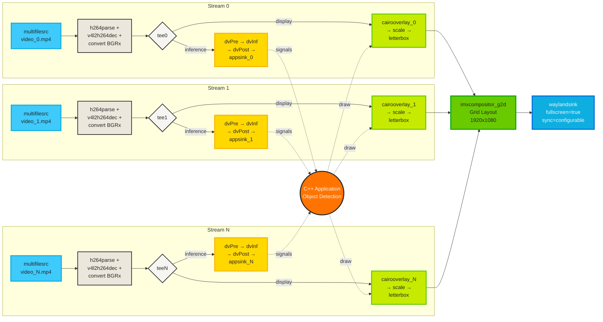

<div align="center">

# Multi-stream GStreamer Example for YOLOv8

[](./LICENSE.txt)
[](https://www.nxp.com/products/processors-and-microcontrollers/arm-processors/i-mx-applications-processors:IMX_HOME)
[](https://isocpp.org/)
[](https://www.nxp.com/docs/en/user-guide/UG10166.pdf)

---

</div>

## 📖 Example Description

This example demonstrates multi-stream object detection using YOLOv8 models (nano, small, medium, large, and extra-large variants) accelerated by the NXP Ara240 DNPU on FRDM i.MX 8M Plus and FRDM i.MX 95 platforms. It leverages GStreamer to process up to **eight simultaneous video streams**, performing real-time inference on each stream independently and compositing the results into a unified mosaic display. Users can select different YOLOv8 model variants at runtime to optimize the balance between detection accuracy and processing speed based on their specific application requirements.

<div align="center">

<br><i>Figure 1. Object detection on eight video streams running on FRDM i.MX 95.</i>
</div>

## 🔰 GStreamer Pipeline - Block Diagram

Below is a block diagram representing the multi-stream GStreamer pipeline for this example.



## ✨ Key Features

- 🎥 **Multi-Stream Processing**: Handles 1 to 8 video streams concurrently with real-time* object detection
- ⚡ **Hardware Acceleration**: Utilizes NXP Ara240 DNPU for efficient YOLOv8n inference
- 🎯 **Multiple Model Support**: Choose from 5 YOLOv8 variants (nano, small, medium, large, extra-large) to balance speed and accuracy
- 🎬 **GStreamer Integration**: Built on robust GStreamer framework for video processing and pipeline management
- 👁️ **Visual Output**: Displays detected objects with bounding boxes in a mosaic layout
- 🔄 **Configurable Synchronization**: Runtime control of frame synchronization behavior via command-line flag
- 📊 **Real-time Performance Metrics**: Live FPS (Frames Per Second) and IPS (Inferences Per Second) overlay for each stream

## 🎯 Target Applications

- 📹 Multi-camera surveillance systems
- 🏭 Industrial monitoring and quality control
- 🏙️ Smart city infrastructure
- 🛒 Retail analytics
- 🚗 Autonomous vehicle testing and validation

## 💻 Supported Platforms

| Platform                                                                                                    | Supported |
| ----------------------------------------------------------------------------------------------------------- | :-------: |
| [FRDM i.MX 8M Plus](https://www.nxp.com/design/design-center/development-boards-and-designs/FRDM-IMX8MPLUS) |     ✅     |
| [FRDM i.MX 95](https://www.nxp.com/design/design-center/development-boards-and-designs/FRDM-IMX95)          |     ✅     |

## ⚙️ Features

### 🔧 Technical Specifications

#### 🤖 AI Model
- **Framework**: Optimized for NXP Ara240 DNPU
- **Object Classes**: 80 COCO dataset classes
- **Detection Capabilities**: Real-time object detection

#### 🎬 Video Processing
- **Supported Input Formats**: H.264, H.265, MJPEG, raw video
- **Buffering**: Hardware-accelerated video decoding

#### 🔌 Connectivity Options
- **PCIe Interface**: High-bandwidth endpoint for maximum throughput
- **Endpoint Selection**: Runtime configurable via command-line options

#### 📏 Scalability
- **Stream Configuration**: Dynamically adjustable from 1 to 8 streams
- **Graceful Degradation**: Maintains performance with varying stream counts

## 📋 Requirements

### 🧰 Hardware

- Supported FRDM i.MX platform
- Ara240 DNPU
- Power supply (5V/3A recommended)
- USB-C debug cable
- HDMI Cable
- 1920x1080 Display monitor

## ⬇️ Download the Models

### 🔄 Automatic Download

The YOLOv8 models are automatically downloaded from Hugging Face Hub during package installation via the `ara2-vision-examples` Debian package postinstall script.

The installation process will automatically fetch the following models:
- YOLOv8n (nano)
- YOLOv8s (small)
- YOLOv8m (medium)
- YOLOv8l (large)
- YOLOv8x (extra-large)

Models are downloaded to: `/usr/share/cnn/detection/yolov8*/`

> **NOTE:** If necessary, configure a DNS before installing the package to ensure successful model downloads:

> ```bash
> echo nameserver 8.8.8.8 > /etc/resolv.conf
> ```

### 🖐️ Manual Download (Alternative)

If the models were not downloaded during installation or you need to download them manually, you can use the `fetch_models` tool:

#### 📋 List the available Models

```bash
fetch_models --list
```

#### ⬇️ Download All YOLOv8 Models

```bash
# Download all YOLOv8 variants from Hugging Face
fetch_models --repo-id nxp/YOLOv8
```

### ✅ Verify Model Installation

To verify that the models have been downloaded successfully:

```bash
# List all downloaded YOLOv8 models
ls -lh /usr/share/cnn/detection/yolov8*
```

### 🔍 Troubleshooting Model Downloads

If you encounter issues downloading models:

1. **🌐 Check DNS Configuration**
  ```bash
  cat /etc/resolv.conf
  # Should contain: nameserver 8.8.8.8
  ```

2. **📡 Check Internet Connectivity**
  ```bash
  ping -c 3 huggingface.co
  ```

3. **💾 Verify Disk Space**
  ```bash
  df -h /usr/share/cnn/
  ```

4. **🛠️ Check fetch_models Tool**
  ```bash
  fetch_models --help
  ```

> **💡 Tip:** You only need to download the models you plan to use. For most applications, starting with YOLOv8n (nano) is recommended due to its balance of speed and accuracy.

## 🚀 Usage

### ▶️ Run the GStreamer pipeline

  ```bash
  multistream_yolov8
  ```

  To customize the number of video streams, use the `-s` or `--stream` option. For example, to run with 4 video streams:

  ```bash
  multistream_yolov8 -s 4
  ```

### 🤖 Model Selection

The application supports different YOLOv8 model variants via the `-m` or `--model` flag. Available models include:

- **yolov8n** (nano) - Default, fastest, lowest accuracy
- **yolov8s** (small) - Balanced speed and accuracy
- **yolov8m** (medium) - Good accuracy, moderate speed
- **yolov8l** (large) - High accuracy, slower
- **yolov8x** (extra-large) - Highest accuracy, slowest

#### ▶️ Run with Default Model (YOLOv8n)

```bash
multistream_yolov8 -s 4
```

#### 🎯 Run with Different Model Variants

```bash
# Use YOLOv8s (small) model
multistream_yolov8 -s 4 --model yolov8s

# Use YOLOv8m (medium) model
multistream_yolov8 -s 4 -m yolov8m

# Use YOLOv8l (large) model
multistream_yolov8 -s 4 --model yolov8l

# Use YOLOv8x (extra-large) model
multistream_yolov8 -s 4 -m yolov8x
```

> **⚠️ Performance Note:** Larger models (yolov8l, yolov8x) provide better accuracy but require more computational resources, which may reduce the maximum number of streams you can run simultaneously while maintaining real-time performance.

### 🔄 Synchronization Control

The application supports configurable frame synchronization via the `-y` or `--sync` flag (sync=false (Default)).

#### ▶️ Run with Default Settings (No Sync - Maximum Throughput)

```bash
multistream_yolov8 -s 4
```

#### 🔁 Run with Synchronization Enabled

```bash
multistream_yolov8 -s 4 --sync true
```

#### ⏭️ Run with Synchronization Explicitly Disabled

```bash
multistream_yolov8 -s 4 --sync false
```

### 🔌 Endpoint Selection

The application supports endpoint selection via the `-e` or `--endpoint` flag to specify a particular endpoint by index.

#### 💡 Example: Run on Endpoint 2

```bash
multistream_yolov8 --endpoint 1
```

>**Note:** Endpoint indices start at 0, so `--endpoint 1` refers to the second endpoint.

### 🎛️ Combined Options Example

```bash
# Run 6 streams on endpoint 0 with synchronization enabled using YOLOv8n
multistream_yolov8 -s 6 --endpoint 0 --sync true

# Run 2 streams on endpoint 1 without synchronization using YOLOv8m
multistream_yolov8 -s 2 --endpoint 1 --sync false --model yolov8m

# Run 4 streams with YOLOv8s model and synchronization
multistream_yolov8 -s 4 -m yolov8s -y true

# Run 8 streams with YOLOv8n for maximum throughput
multistream_yolov8 -s 8 -m yolov8n -y false
```

#### ⚠️ Limitations

- All video streams will run on the same endpoint.
- Currently, users cannot assign individual streams to different endpoints.
- Larger models may reduce maximum achievable stream count for real-time performance.

## 📊 Performance Analysis

### 🎯 Understanding Sync vs. No-Sync Behavior

The GStreamer pipeline's synchronization behavior is controlled by the `waylandsink` element's `sync` property, which can be configured at runtime using the `--sync` flag.

#### 🚫 What is `sync=false` (Default)?
- **No Synchronization**: Each stream processes frames independently at maximum speed
- **Variable FPS**: Frame rates vary based on CPU load and number of streams
- **Maximum Throughput**: Optimized for highest total inference per second (IPS)
- **Lower Latency**: Frames are displayed immediately without waiting for clock synchronization
- **Best for**: Applications prioritizing processing speed over frame rate consistency

#### ✅ What is `sync=true`?
- **Synchronized Playback**: Attempts to maintain consistent frame rates across all streams
- **Clock-Based Timing**: Uses GStreamer pipeline clock to pace frame delivery
- **Fixed FPS Target**: Typically targets 30 FPS per stream when possible
- **CPU Dependent**: Performance degrades when CPU cannot maintain sync
- **Higher Latency**: Frames may be delayed to maintain synchronization
- **Best for**: Applications requiring consistent frame timing (e.g., video recording, synchronized multi-camera systems)

> ⚠️ **Important**: Enabling `sync=true` may improve frame rate consistency but can significantly reduce overall performance when the CPU cannot handle the synchronization overhead, especially with higher stream counts. This will vary for different i.MX platforms.

## 📈 Platform Performance Comparison

### 🚀 FRDM i.MX 95 Performance

<table>
  <tr>
    <th rowspan="2">Streams (-s)</th>
    <th colspan="2">sync=false (Default)</th>
    <th colspan="2">sync=true</th>
  </tr>
  <tr>
    <th>FPS</th>
    <th>IPS</th>
    <th>FPS</th>
    <th>IPS</th>
  </tr>
  <tr>
    <td>1</td>
    <td>55</td>
    <td>55</td>
    <td>30</td>
    <td>30</td>
  </tr>
  <tr>
    <td>2</td>
    <td>60</td>
    <td>60</td>
    <td>30</td>
    <td>30</td>
  </tr>
  <tr>
    <td>3</td>
    <td>50</td>
    <td>50</td>
    <td>30</td>
    <td>30</td>
  </tr>
  <tr>
    <td>4</td>
    <td>40</td>
    <td>40</td>
    <td>30</td>
    <td>30</td>
  </tr>
  <tr>
    <td>5</td>
    <td>35</td>
    <td>35</td>
    <td>30</td>
    <td>30</td>
  </tr>
  <tr>
    <td>6</td>
    <td>30</td>
    <td>30</td>
    <td>30</td>
    <td>30</td>
  </tr>
  <tr>
    <td>7</td>
    <td>27</td>
    <td>27</td>
    <td>27 ⚠️</td>
    <td>27 ⚠️</td>
  </tr>
  <tr>
    <td>8</td>
    <td>24</td>
    <td>24</td>
    <td>24 ⚠️</td>
    <td>24 ⚠️</td>
  </tr>
</table>

**📊 FRDM i.MX 95 Analysis:**
- ✅ **Excellent sync performance** up to 6 streams (maintains 30 FPS)
- ⚠️ **Sync degradation** starts at 7+ streams
- 🚀 **Best platform** for synchronized multi-stream applications
- 💪 **Strong CPU** handles synchronization overhead well

### 💻 FRDM i.MX 8M Plus Performance

<table>
  <tr>
    <th rowspan="2">Streams (-s)</th>
    <th colspan="2">sync=false (Default)</th>
    <th colspan="2">sync=true</th>
  </tr>
  <tr>
    <th>FPS</th>
    <th>IPS</th>
    <th>FPS</th>
    <th>IPS</th>
  </tr>
  <tr>
    <td>1</td>
    <td>35</td>
    <td>35</td>
    <td>30</td>
    <td>30</td>
  </tr>
  <tr>
    <td>2</td>
    <td>41</td>
    <td>41</td>
    <td>30</td>
    <td>30</td>
  </tr>
  <tr>
    <td>3</td>
    <td>31</td>
    <td>31</td>
    <td>30</td>
    <td>30</td>
  </tr>
  <tr>
    <td>4</td>
    <td>24</td>
    <td>24</td>
    <td>27 ⚠️</td>
    <td>27 ⚠️</td>
  </tr>
  <tr>
    <td>5</td>
    <td>22</td>
    <td>22</td>
    <td>24 ⚠️</td>
    <td>24 ⚠️</td>
  </tr>
  <tr>
    <td>6</td>
    <td>19</td>
    <td>19</td>
    <td>20 ⚠️</td>
    <td>20 ⚠️</td>
  </tr>
  <tr>
    <td>7</td>
    <td>17</td>
    <td>17</td>
    <td>17 ⚠️</td>
    <td>17 ⚠️</td>
  </tr>
  <tr>
    <td>8</td>
    <td>15</td>
    <td>15</td>
    <td>11 ⚠️</td>
    <td>11 ⚠️</td>
  </tr>
</table>

**📊 i.MX 8M Plus Analysis:**
- ✅ **Good sync performance** up to 3 streams (maintains 30 FPS)
- ⚠️ **Sync degradation** starts at 4+ streams
- 📉 **CPU limitations** more apparent with synchronization enabled
- 💡 **Recommendation**: Use `sync=false` for 4+ streams on this platform

## 💡 Performance Recommendations

### 🚫 When to Use `sync=false` (Default)
- ✅ Maximum throughput is priority
- ✅ Running 4+ streams on FRDM i.MX 8M Plus
- ✅ Running 7+ streams on FRDM i.MX 95
- ✅ Real-time inference applications where frame timing is flexible
- ✅ Batch processing scenarios
- ✅ Applications where lower latency is more important than consistent frame rate

### ✅ When to Consider `sync=true`
- ✅ Consistent frame rates are required
- ✅ Running ≤3 streams on FRDM i.MX 8M Plus
- ✅ Running ≤6 streams on FRDM i.MX 95
- ✅ Synchronized multi-camera recording
- ✅ Applications requiring predictable frame timing
- ✅ Video playback scenarios where smooth motion is critical

### 🎯 Platform-Specific Recommendations

#### 🚀 FRDM i.MX 95
```bash
# Optimal for maximum throughput (1-8 streams)
multistream_yolov8 -s 8 --sync false

# Optimal for synchronized playback (1-6 streams)
multistream_yolov8 -s 6 --sync true
```

#### 💻 FRDM i.MX 8M Plus
```bash
# Optimal for maximum throughput (1-8 streams)
multistream_yolov8 -s 8 --sync false

# Optimal for synchronized playback (1-3 streams)
multistream_yolov8 -s 3 --sync true
```

> 📝 **Note**: The performance metrics shown are measured under standard test conditions. Actual performance may vary based on video content complexity, system load, and other running processes.

## 🔧 Troubleshooting

### 🎥 Video stream issues
- Verify test videos exist: `ls /usr/share/ara2-vision-examples/sample_videos/`

### ⚡ Performance issues
- Monitor CPU usage: `top`
- Reduce number of streams if needed: `multistream_yolov8 -s 4`
- Try disabling synchronization for better throughput: `multistream_yolov8 -s 4 --sync false`
- If experiencing frame drops with `sync=true`, either reduce stream count or switch to `sync=false`

### 🔌 Endpoint connection errors
- List available endpoints: `chip_info.sh`

### 📊 Model inference errors
- Verify model file is present: `ls -lh /usr/share/cnn/detection/yolov8n/`

### 🐛 General debugging
- Enable verbose logging: Set `GST_DEBUG=3` environment variable
- Check GStreamer pipeline status: `GST_DEBUG=2 multistream_yolov8 -s 1`

## 📄 Licensing

This example is licensed under the [BSD-3-Clause](./LICENSE.txt) license.